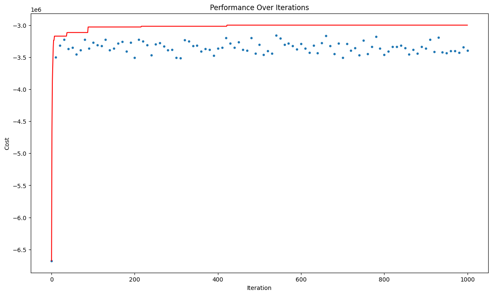
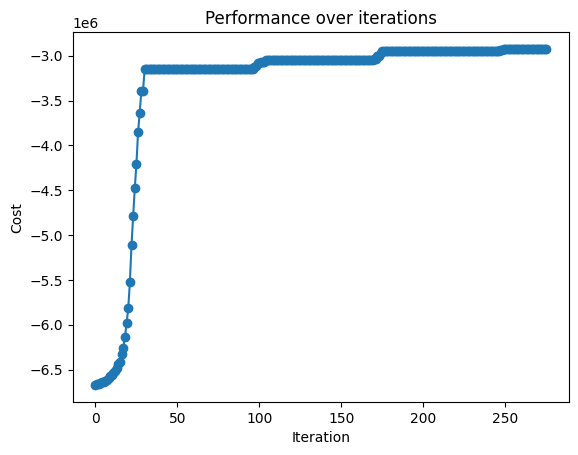

# CI2024_lab1

## Problem description
The Set Cover Problem is a classical optimization problem. Given a universe 𝑈 of elements and a collection 𝑆 of subsets of 𝑈 and a cost vector C for each subset, the goal is to find the cheapest list of subsets from 𝑆 whose union covers all elements in the universe 𝑈.

## Fitness landscape
The solution we aim to identify must satisfy the following criteria:

1. Validity, meaning it includes all elements of U;
2. Minimal cost.
Both conditions must be accounted for to ensure the solution is a local minimum in terms of cost while also satisfying our constraints.

To achieve this, we may define a fitness function that returns a tuple of elements.

The first element could be an integer value between zero and one.
The second element might represent the inverse of the cost.
However, this approach has a potential drawback: if we begin with an invalid solution (where the first element is zero), the fitness landscape will have a local minimum at a solution represented by (0,minCost). In this case, minCost would also be zero, as the solution would simply consist of an empty list of subsets.

To address this issue, we can refine the fitness function to account more precisely for the number of violated constraints. Instead of using zero or one as the first element, we can return the count of included elements.

It’s important to note that Python compares tuples using lexicographic ordering. This ensures that the validity of a solution is always prioritized over its cost. 


```python
def fitness(solution: np.ndarray):
    """Restituisce la fitness di una soluzione, bilanciando costo e copertura."""    
    coverage = satisfied_count(solution)
    cost_value = -1 * cost(solution)
    return (coverage, cost_value)
```

## Tweak function

I experimented with various tweaking functions, but the one that performed best was a function that adjusted the solution based on the cost of the set.

This approach assumes that sets with lower costs should have a lower probability of being tweaked, as they are more significant than others.

The function incorporates the "strength" of the mutation, allowing it to perturb the current solution with varying intensities depending on the given parameter. The mutation itself is computed using the XOR operation.


```python
def multiple_mutation(solution, strength=0.3):
    mask=rng.random(NUM_SETS)<strength
    #verify is the mask is made by all zero values:
    if not np.any(mask):
	    # put at least one True value because otherwise we are not changing the solution.
        mask[rng.integers(NUM_SETS)] = True
    new_solution=np.logical_xor(solution, mask)
    return new_solution
```

# Simulated annealing solution

Let's consider a simple function that starts form a solution of all True values, so a solution that include all the possible sub-sets (so a valid and costly solution). We want to iterate for a certain number of iterations and compute, at each iteration, a new solution by tweaking the current solution and then compare the performance of the current sample with the just generated one.

The simplest thing to do would be to discard the new solution in the case it provides a worse fitness score. However, we could demonstrate that our problem is not characterized by a very strong causality (meaning that sometimes is better to mantain a worse solution, in order to reach the optimal value). The best idea in this case will be to consider a simulated aLet's consider a simple function that starts with a solution containing all True values—essentially, a solution that includes all possible subsets (valid but highly costly). The goal is to iterate over a predefined number of iterations, generating a new solution at each step by tweaking the current one. We then compare the performance of the current solution with the newly generated one.

The simplest approach would be to discard the new solution if it yields a worse fitness score. However, we can demonstrate that our problem does not exhibit strong causality—meaning that sometimes it is beneficial to retain a worse solution to eventually reach the optimal value.

In such cases, the best approach is to use simulated annealing, where worse solutions are accepted with a probability determined by an adaptive parameter known as "temperature."nnealing aproach accepting to choose worse solutions with a probability that depends on an adapting parameter called "temperature".
```python

def simulated_annealing_accept(new_fitness, current_fitness, temperature):
    """Accept a new solution with a probability value that depends on the temperature"""
    if new_fitness > current_fitness:
        return True
    else:
        delta_fitness = (current_fitness[1] - new_fitness[1]) / temperature
        # let's avoid overflow issues:
        delta_fitness = np.clip(delta_fitness, -500, 500)
        return np.exp(delta_fitness) > rng.random()

ITERATIONS = 1000
solution= rng.random(NUM_SETS)<1
history = [float(fitness(solution)[1])]

ic(float(fitness(solution)[1]))

for steps in tqdm(range(ITERATIONS)):
    new_solution = multiple_mutation(solution)
    new_fitness = fitness(new_solution)
    history.append(float(new_fitness[1]))

    temperature = 1.0 * (0.01 / 1.0) ** (steps / ITERATIONS)

    if simulated_annealing_accept(new_fitness, fitness(solution), temperature):
        solution = new_solution
```

This solution performs well, allowing the algorithm to reach a reasonable local minimum within a limited time. However, the primary issue lies in using a fixed number of iterations.

In most cases, this approach is suboptimal because the algorithm often fails to improve the solution beyond a certain point. This is likely due to the algorithm settling into a local minimum, making it difficult to further tweak the solution once that state is reached.

To illustrate this problem, I provide the results obtained for an instance of the problem with the following parameters:
```python
UNIVERSE_SIZE = 10_000
NUM_SETS = 1_000
DENSITY = 0.3 
```



## Adaptive mutation solution
In this second version of the algorithm, we aim to make the following changes:

1. Optimize the number of iterations: We use a fine-tuned value to avoid wasting execution time on iterations that yield no improvements.
2. Introduce an adaptive mutation step: This dynamically adjusts the mutation step value during the algorithm's execution.
The complete code is as follows:

```python
solution= rng.random(NUM_SETS)<1
history = []

buffer = []
lunghezza = int(int(DENSITY*100 * np.log(UNIVERSE_SIZE)) / 7)
solution_fitness = (0, -np.inf) 

step_size = 0.1

for steps in tqdm(range(int(DENSITY*100 * np.log(UNIVERSE_SIZE)))):
    if steps < int(DENSITY*100 * np.log(UNIVERSE_SIZE)) * 0.2:
        new_solution = weighted_mutation(solution, strength=step_size * 4) 
    else:
        new_solution = weighted_mutation(solution, strength=step_size)

    new_fitness = fitness(new_solution)
    
    buffer.append(new_fitness > solution_fitness)
    
    # Se trovo una soluzione migliore, aggiorno
    if new_fitness > solution_fitness:
        solution_fitness = new_fitness
        solution = new_solution

    history.append(float(solution_fitness[1]))

    if len(buffer) > lunghezza:
        buffer.pop(0)

    if np.sum(buffer) > 1:
        step_size = step_size + 0.3*step_size
    else:
        step_size = step_size - 0.3*step_size

```


This improves a lot the execution time for finding the solution without increasing its cost value.

I show the results obtained by this second version of the code using the same instance problem as before:



## After reviews
After the reviews received I tried to follow the suggestion of merging the 2 approaches (simulated annealing and adapting mutation solution) with the following code:

```python
solution= rng.random(NUM_SETS)<1
history = []

buffer = []
lunghezza = int(int(DENSITY*100 * np.log(UNIVERSE_SIZE)) / 7)
solution_fitness = (0, -np.inf) 

step_size = 0.1

for steps in tqdm(range(int(DENSITY*100 * np.log(UNIVERSE_SIZE)))):
    if steps < int(DENSITY*100 * np.log(UNIVERSE_SIZE)) * 0.2:
        new_solution = weighted_mutation(solution, strength=step_size * 4) 
    else:
        new_solution = weighted_mutation(solution, strength=step_size)

    new_fitness = fitness(new_solution)
    
    buffer.append(new_fitness > solution_fitness)
    
    # Se trovo una soluzione migliore, aggiorno
    temperature = 1.0 * (0.01 / 1.0) ** (steps / ITERATIONS)  # Vado a ridurew la temperatura
    if simulated_annealing_accept(new_fitness, fitness(solution), temperature):
        solution = new_solution
        solution_fitness = new_fitness

    history.append(float(solution_fitness[1]))

    if len(buffer) > lunghezza:
        buffer.pop(0)

    if np.sum(buffer) > 1:
        step_size = step_size + 0.3*step_size
    else:
        step_size = step_size - 0.3*step_size

print("ris finale", fitness(solution)[1])
plt.plot(range(0, len(history)), history, marker='o')  
plt.title("Performance over iterations")
plt.xlabel("Iteration")
plt.ylabel("Cost")
plt.show()
```

It improved a lot the time efficiency of the code by being able to detect a good solution in less time.